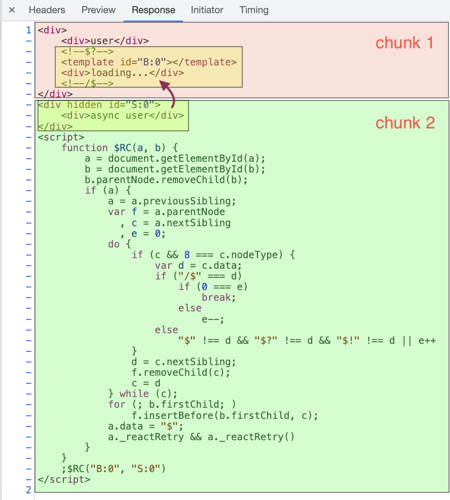

## Explore React streaming in SSR

Trying to analyze how React streaming works in SSR, and how to use it.

The main API is used as below:
```js
import { renderToPipeableStream, renderToString } from 'react-dom/server'
```
### 1) `renderToString`

just render the page once as normal string, so the browser will render the whole page at once, any async state will be ignored at server side and activated at client side.

### 2) `renderToPipeableStream`

render components as [PipeableStream](https://nodejs.org/api/stream.html#stream_class_stream_readable), so you can pipe it to any writable stream. Specifically, it will render the first snapshot as string, then render the rest of the components that are not rendered yet(mostly wrapped in `Suspense`) as `chunks`.

For example, pipe it to [http.ServerResponse](https://nodejs.org/api/http.html#http_class_http_serverresponse) to send it to client **by chunks**, by taking advantage of the browser that is now able to partially render incoming chunks, and render the chunks as soon as they are received later, so we could make progressive rendering from the server.

### 3) Good to know

html streaming must be in order, render something one by one, so how `Suspense` works that replace the `fallback` when the async component is ready? Let's seen what's generated in the chunks by `renderToPipeableStream`:



1. the `chunk 1` is received at the beginning, the browser renders it, so we see a `loading...` as fallback.
2. and the `chunk 2` is received after 2 seconds, it contains result `component` and `script`.
3. the browser renders a `hidden` element, and the code in the `script` that replace the `loading` with the element.

## Installation & Usage

```bash
pnpm i
pnpm dev
```

## References 
- [Serve Rendering](https://reactjs.org/docs/react-dom-server.html) 
- [RenderToPipeableStream](https://beta.reactjs.org/reference/react-dom/server/renderToPipeableStream)
- [Pipeable Streams](https://nodejs.org/api/stream.html#stream_class_stream_readable)

This feature is used in [Next.js 13](https://beta.nextjs.org/docs/routing/loading-ui) and [React Server Components](https://reactjs.org/blog/2020/12/21/data-fetching-with-react-server-components.html).
